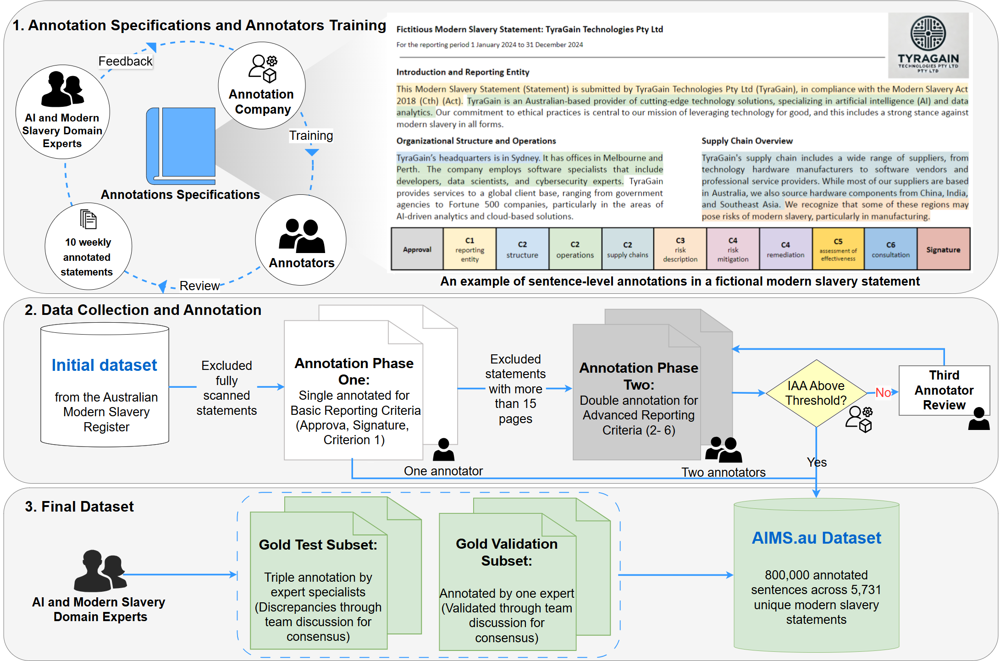

# AIMS.au: A Dataset for the Analysis of Modern Slavery Countermeasures in Corporate Statements
Analysis of modern slavery statements from Australian-based organizations.

*Appearing in ICLR 2025*

We are releasing under the CC-BY licence a new dataset in the field of Modern Slavery to help evaluate an finetune Large Language Models (LLMs) for the assessment of corrporate statements. The dataset is composed
of 5,731 modern slavery statements taken from the Australian Modern Slavery Register and annotated at the sentence level.

This is a combination of modern slavery statements published in PDF format by corporate entities and of sentence-level labels provided by human annotators and domain expert analysts. A total of 5,670 statements were processed by hired annotators with respect to the three basic reporting criteria of the Act to determine whether each statement is approved, signed, and has a clearly-identified reporting entity. The other more advanced reporting criteria involve nuanced interpretations and required higher levels of scrutiny; for these, a subset of 4,657 statements that were found to be of a reasonable length were double annotated by hired annotators. Lastly, two specialized “gold” subsets with each 50 unique statements were created by experts to allow for evaluations with higher reliability across all criteria. The first gold subset was annotated by a single expert and validated through team discussions, while the second gold subset underwent a collaborative annotation process involving three experts. In all cases, disagreements were discussed until the experts achieved consensus. The final result is over 800,000 labeled sentences across 5,731 unique modern slavery statements covering 7,270 Australian entities between 2019 and 2023.

Given what is above, statements annotated by hired workers should be used for model training, while statements in the first “gold” subset should be used for model validation, and statements in the second gold
subset should be used for model testing for optimal trust in model performance assessments. 

By releasing this dataset, we firmly believe that it could serve as a key milestone in the development of tools dedicated in assisting human experts in verifying the compliance of corpoare statements, providing a foundation for further advancements in this area.

To the best of our knowledge, this is the first large-scale dataset that includes fine-grained annotations with respect to the mandatory criteria as reuired my the Australian Modern Slavery Act (MSA).

- [AIMS.au: A Dataset for the Analysis of Modern Slavery Countermeasures in Corporate Statements](#aims-au-a-dataset-for-the-analysis-of-modern-slavery-countermeasures-in-corporate-statements)
  - [Availability](#availability)
  - [Dataset documentation](#dataset-documentation)
  - [Dataset statistics](#dataset-statistics)
  - [Experiments](#experiments)

## Availability

- Our **paper** is available on [arXiv](https://arxiv.org/abs/2502.07022).
- The **dataset** on [figshare](https://figshare.com/articles/dataset/DDXPlus_Dataset/20043374) and [Huggingface](https://huggingface.co/datasets/mila-ai4h/AIMS.au).

<!-- #FIXME: check the date and add link-->

## Dataset documentation

The image below highlights correspondences between the AU MSA Mandatory Criteria and the questions designed for the annotation of the proposed AIMS.au dataset, with fictitious examples of disclosures that could be
found in statements published by reporting entities.

## Dataset statistics

Here is an overview of the distribution of text across the 5,731 statements in our proposed dataset.

## Experiments

Code for reproducing results in the paper can be found in [`code`](code).

In our paper, we conducted experiments using a range of language models that includes four open models — DistilBERT (Sanh et al., 2020), BERT (Devlin et al., 2019), Llama2 (7B) (Touvron et al., 2023) and Llama3.2 (3B) (Dubey et al., 2024) — and two closed models, namely OpenAI’s GPT3.5 Turbo and GPT4o.
