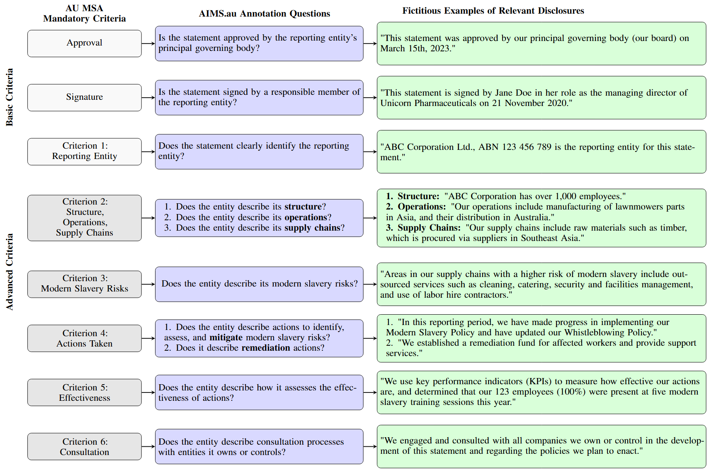
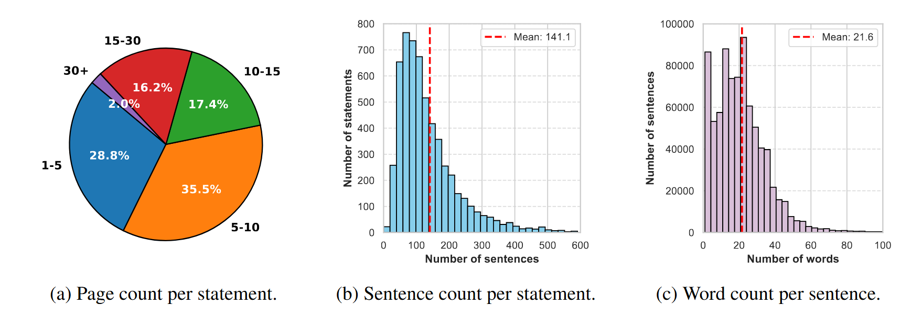
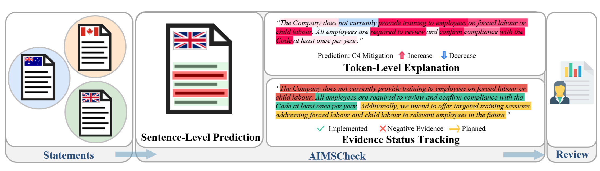
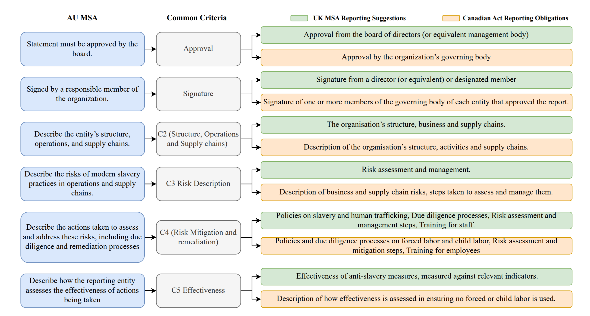

This repository presents published papers and their associated artifacts, developed as part of a larger initiative, [**Project AIMS (AI Against Modern Slavery)**](https://mila.quebec/en/ai4humanity/applied-projects/ai-against-modern-slavery-aims), developed in a partnership between Mila and Queensland University of Technology (QUT). 

This research was developed by Mila - Quebec AI Institute in collaboration with the Queensland University of Technology.

Part of this research was supported by the National Action Plan to Combat Modern Slavery 2020-25 Grants Program, administered by the AttorneyGeneral’s Department.

## Associated Resources
- 📂 **Dataset**: Accessible via [Figshare](https://figshare.com/s/1b92ebfde3f2de2be0cf) and [Hugging Face](https://huggingface.co/datasets/mila-ai4h/AIMS.au).
- 💬 **Prompts**: The prompts used in our experiments can be found in [AIMSPrompts](AIMSPrompts.docx).
- 💻 The code to reproduce our experimental results is available in the [`code`](code) directory.
- 📦 The weights of our best-performing model (Llama3.2 3B, +100 words context)  from our experiments are available on [Figshare](https://figshare.com/articles/dataset/LLAMA_context_100_weights/29174045?file=54904154).
---

## Paper 1: AIMS.au: A Dataset for the Analysis of Modern Slavery Countermeasures in Corporate Statements  
*Appearing in ICLR 2025*  
📄 **Paper**: Available on [arXiv](https://arxiv.org/abs/2502.07022).  

We introduce **AIMS.au**, a publicly available dataset designed to support the analysis of modern slavery statements from Australian-based organizations. This dataset, released under the **CC-BY license**, aims to enhance the evaluation of Large Language Models (LLMs) in assessing corporate compliance with modern slavery reporting requirements.  

### Key Features  
- **Comprehensive Coverage**: Over **5,700** modern slavery statements sourced from the [**Australian Modern Slavery Register**](https://modernslaveryregister.gov.au/).  
- **Detailed Annotations**: Sentence-level labels assigned by human annotators and domain experts. Basic reporting criteria, such as approval, signature, and identification of the reporting entity, were single-annotated. In contrast, more complex reporting criteria, requiring nuanced interpretation and greater scrutiny, were double-annotated for a subset of 4,657 statements.  
- **Gold Standard Subsets**: Two expert-annotated subsets, each containing **50** unique statements, designed to ensure high-reliability evaluations.  
- **Extensive Sentence-Level Data**: More than **800,000** labeled sentences covering **7,270** Australian entities from **2019 to 2023**.  

### Data Structure  
The dataset consists of three primary annotation levels:  
1. **Annotated dataset** – Suitable for **model training**.  
2. **Gold subset (single expert validation)** – Recommended for **model validation**.  
3. **Gold subset (triple-expert consensus)** – Reserved for **model testing**, ensuring the highest trust in model performance assessments.  


By making this dataset publicly available, we aim to advance research in automated compliance verification, offering a valuable resource for developing tools that assist human experts in assessing corporate transparency and accountability.  

To our knowledge, **AIMS.au** is the most extensive open source dataset with detailed annotations explicitly aligned with the **mandatory criteria** of the Australian **Modern Slavery Act (MSA)**.  

---

## Dataset Documentation  

The following image illustrates the **correspondence between the AU MSA mandatory criteria** and the **questions designed for annotation** within the **AIMS.au** dataset. It also includes **fictitious examples** of disclosures that could appear in real corporate statements.  

  

---

## Dataset Statistics  

Below is an overview of the text distribution across **5,731 modern slavery statements** in our dataset.  

  

---
### Experimental Setup and Results
**Task:** sentence-level binary classification across 11 questions.

**Evaluated Models:** fine-tuned on AIMS.au (DistilBERT, BERT, Llama2 (7B), Llama3.2 (3B) and zero-shot (GPT-3.5 Turbo), GPT-4o, Llama3.2 (3B).

**Input Settings:** no context - classify using only the target sentence, and with context – classify using the sentence plus ±100 surrounding words.

**Key Results:** Fine-tuned models outperform zero-shot models, and including context improves results.


These models were evaluated based on their ability to assess corporate compliance with modern slavery reporting standards—full details in the paper. 

---
## Paper 2: AIMSCheck: Leveraging LLMs for AI-Assisted Review of Modern Slavery Statements Across Jurisdictions
*Appearing in ACL 2025*  
📄 **Paper**: Available on [arXiv](https://arxiv.org/abs/2506.01671).  

**AIMSCheck** is an end-to-end framework for AI-assisted review of modern slavery statements using Large Language Models (LLMs). It addresses two key challenges:
1. The difficulty of compliance verification due to the diverse and complex language used in disclosures.
2. The need for generalizable AI tools across jurisdictions with different legal standards.

**We introduce:**

1.**AIMSCheck**, an end-to-end framework for compliance validation

2.Two new annotated datasets from the UK **(AIMS.uk)** and Canada **(AIMS.ca)** to enable cross-jurisdictional benchmarking.

## AIMSCheck

  
Our contribution is the introduction of AIMSCheck (AI against Modern Slavery Compliance Checks), an end-to-end framework designed to assist human analysts in assessing compliance. As illustrated in the figure above, AIMSCheck operates at three distinct levels:

1. **Sentence-Level**: Classifies each sentence based on its relevance to compliance criteria.
2. **Token-Level**: Enhances model transparency through explainability metrics.
3. **Evidence Status**: Tracks sentences that support or refute the implementation or future commitments of measures, which we refer to as evidence.


## Generalizability 

We have created a jurisdictional mapping to assess the generalizability across different regions, as illustrated in the figure below. In this context, we introduce the AIMS.uk and AIMS.ca datasets, which are derived from modern slavery statements collected from government registries in the UK and Canada. Each dataset consists of 50 statements that have been manually annotated by a domain expert. These diverse and well-structured datasets facilitate the cross-jurisdictional evaluation of modern slavery disclosures.

  

## Experimental Setup and Results
**Task:** Sentence-level binary classification across 9 compliance criteria, plus evidence status tracking.

**Evaluated Models:** Zero-shot (GPT-3.5 Turbo, GPT-4o), few-shot (GPT-4o with CoT and examples), DeepSeek-R1 and fine-tuned models (DistilBERT, BERT, LLaMA 2 (7B), LLaMA 3.2 (3B)). 

**Input Settings:** Models evaluated both with no context (single sentence) and with context (sentence ±100 words). Token-level explanation used SHAP.

### Key Results:

1. Fine-tuned models on AIMS.au generalise well to AIMS.uk and AIMS.ca, outperforming zero-shot and few-shot baselines.

2. CoT Few-shot prompting improves GPT-4o performance over zero-shot;

3. Contextual input (±100 words) improves performance across models.


## Citation  

If you use **AIMS.au** in your research, please cite our paper:

```bibtex
@article{bora2025aimsau,
  title={AIMS.au: A Dataset for the Analysis of Modern Slavery Countermeasures in Corporate Statements},
  author={Bora, Adriana Eufrosina and St-Charles, Pierre-Luc and Bronzi, Mirko and Fansi Tchango, Arsène and Rousseau, Bruno and Mengersen, Kerrie},
  journal={arXiv preprint arXiv:2502.07022},
  year={2025},
  note={Camera ready. ICLR 2025},
  url={https://arxiv.org/abs/2502.07022},
  doi={10.48550/arXiv.2502.07022}
}

@article{bora2025aimscheck,
  title={AIMSCheck: Leveraging LLMs for AI-Assisted Review of Modern Slavery Statements Across Jurisdictions},
  author={Bora, Adriana Eufrosina and Arodi, Akshatha and Zhang, Duoyi and Bannister, Jordan and Bronzi, Mirko and Fansi Tchango, Arsène and Bashar, Md Abul and Nayak, Richi and Mengersen, Kerrie},
  journal={arXiv preprint arXiv:2506.01671},
  year={2025},
  note={To appear at ACL 2025},
  url={https://arxiv.org/abs/2506.01671},
  doi={10.48550/arXiv.2506.01671}
}
